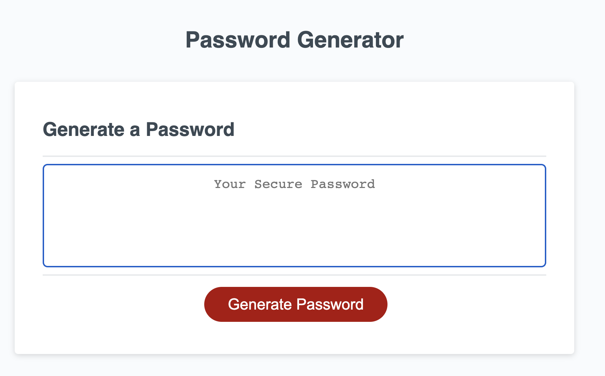
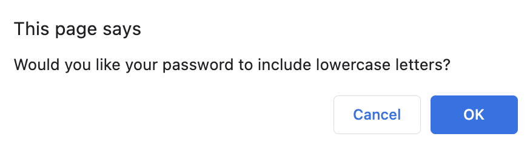
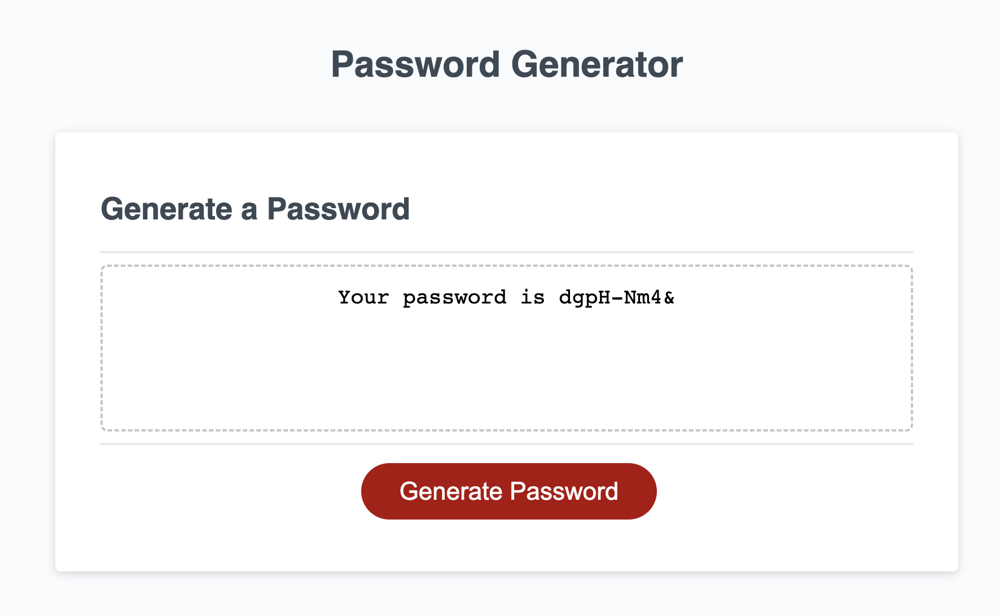

# Password Generator Starter Code

## Description
Password generator utilizing JavaScript. Challenge assignment for UCB bootcamp week 3.

## Installation

N/A

## Usage

 
Access this page [here](https://malxxy.github.io/password-generator/).
Access the GitHub repository [here](https://github.com/malxxy/password-generator).
 
Select the "Generate" button and the user will be led through various prompts to personalize your password. After the user answers all the prompts a password with their desired characters and desired length is generated.
 
Password Generator homescreen:

 
Prompt to choose password length:

 
Prompt to confirm if user would like lowercase characters or not:

 
Final password example:

 

## Credits

N/A

## License

N/A